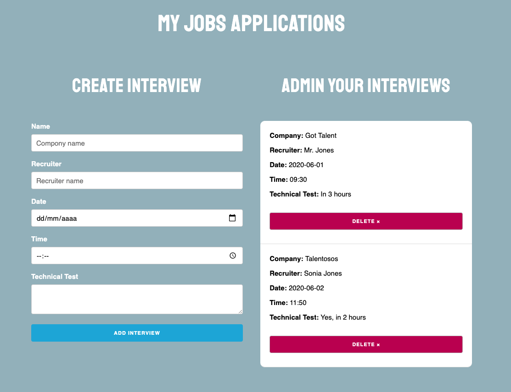

# My interviews APP

## Description
Project with React.js. This is an app to document a job interviews.

## Scripts
In the project directory, you can run:

### `yarn start`

## Technology Stack
- React.js
- Hooks
- Node.js
- Yarn
- Html
- Css
- [UUID Library](https://www.npmjs.com/package/uuid)
- [Netlify](https://www.netlify.com/)

## Git repo
The url to repository and deployed project:

- [Repository Frontend Link](https://github.com/elenapiaggio/my-interviews)
- [Deploy Link](https://my-interviews.netlify.app/)

Made with :heart: by Elena